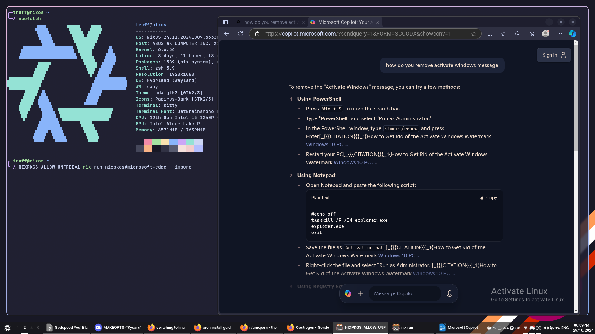
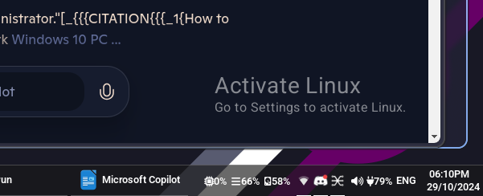
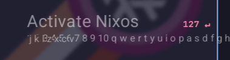

# Activate-Linux

A stupid little joke program for Linux




## Running

Ensure libxkbcommon and pkg-config are installed, then simply `cargo run`.

The repo can also be ran as a flake:
```
nix run github:Kaisia-Estrel/activate-linux
```

specify `--header` and `--caption` to change the text of the overlay, however this doesnt
check the actual length of the text so it may draw over itself if it's too long.

```
activate-linux --header "Activate Nixos" --caption "1 2 3 4 5 6 7 8 9 10 q w e r t y u i o p a s d f g h j k l z x c v"
```

